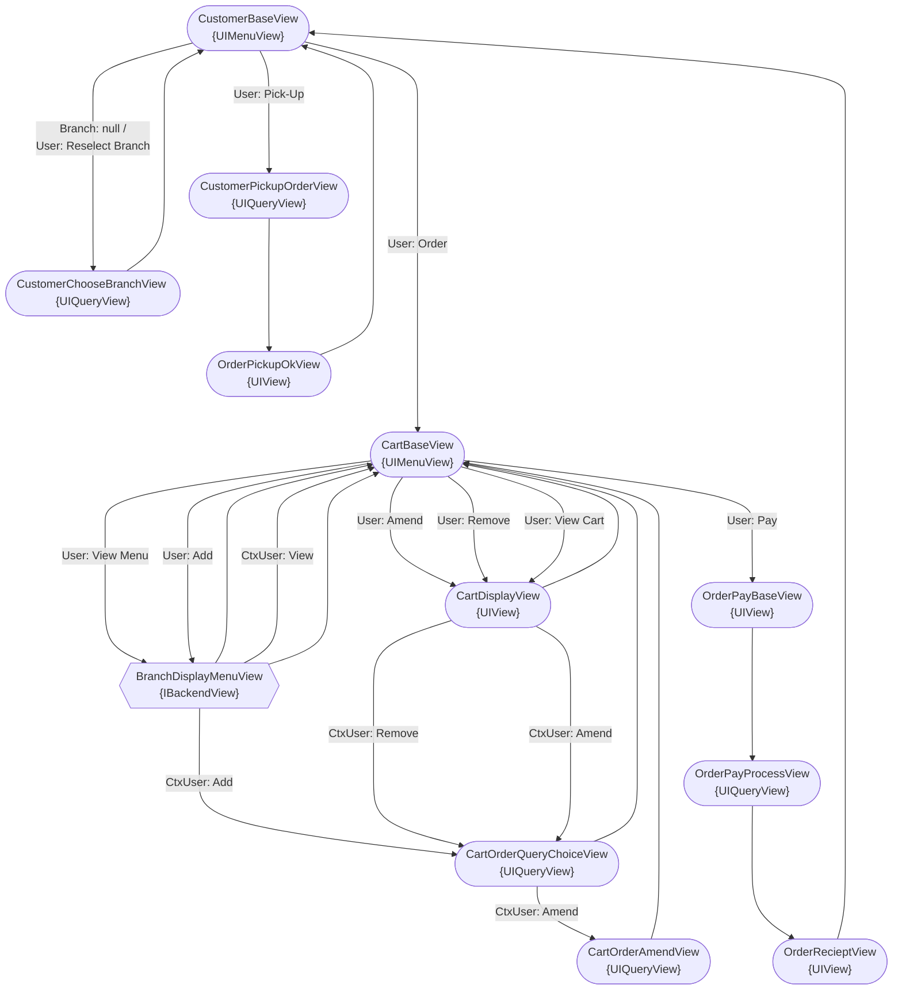

```mermaid
flowchart TD

CustomerBaseView(["CustomerBaseView \n{UIMenuView}"])

CustomerChooseBranchView(["CustomerChooseBranchView \n{UIQueryView}"])
CustomerPickupOrderView(["CustomerPickupOrderView \n{UIQueryView}"])
OrderPickupOkView(["OrderPickupOkView \n{UIView}"])
CartBaseView(["CartBaseView \n{UIMenuView}"])
CartDisplayView(["CartDisplayView \n{UIView}"])
BranchDisplayMenuView{{"BranchDisplayMenuView \n{IBackendView}"}}
CartOrderQueryChoiceView(["CartOrderQueryChoiceView \n{UIQueryView}"])
OrderPayBaseView(["OrderPayBaseView \n{UIView}"])
OrderPayProcessView(["OrderPayProcessView \n{UIQueryView}"])
OrderRecieptView(["OrderRecieptView \n{UIView}"])
CartOrderAmendView(["CartOrderAmendView \n{UIQueryView}"])

CustomerBaseView            ----> | Branch: null /\n User: Reselect Branch| CustomerChooseBranchView
CustomerChooseBranchView    ---> CustomerBaseView
CustomerBaseView            ------> | User: Order | CartBaseView
CustomerBaseView            ---> | User: Pick-Up | CustomerPickupOrderView
CustomerPickupOrderView     ---> OrderPickupOkView
OrderPickupOkView           ---> CustomerBaseView

CartBaseView           ---> | User: View Menu | BranchDisplayMenuView
BranchDisplayMenuView       ---> CartBaseView

CartBaseView                ---> | User: Add | BranchDisplayMenuView
CartBaseView                ---> | User: Amend | CartDisplayView
CartBaseView                ---> | User: Remove | CartDisplayView
CartBaseView                ---> | User: Pay | OrderPayBaseView
CartBaseView                ---> | User: View Cart | CartDisplayView
BranchDisplayMenuView       ----> | CtxUser: View | CartBaseView
BranchDisplayMenuView       ---> CartBaseView

OrderPayBaseView            ---> OrderPayProcessView
OrderPayProcessView         ---> OrderRecieptView
OrderRecieptView            --> CustomerBaseView

BranchDisplayMenuView       ---> | CtxUser: Add | CartOrderQueryChoiceView
CartDisplayView             ---> | CtxUser: Remove | CartOrderQueryChoiceView
CartDisplayView             ---> | CtxUser: Amend | CartOrderQueryChoiceView
CartDisplayView             ---> CartBaseView
CartOrderQueryChoiceView        --> | CtxUser: Amend | CartOrderAmendView
CartOrderQueryChoiceView        ----> CartBaseView
CartOrderAmendView              --> CartBaseView

```
