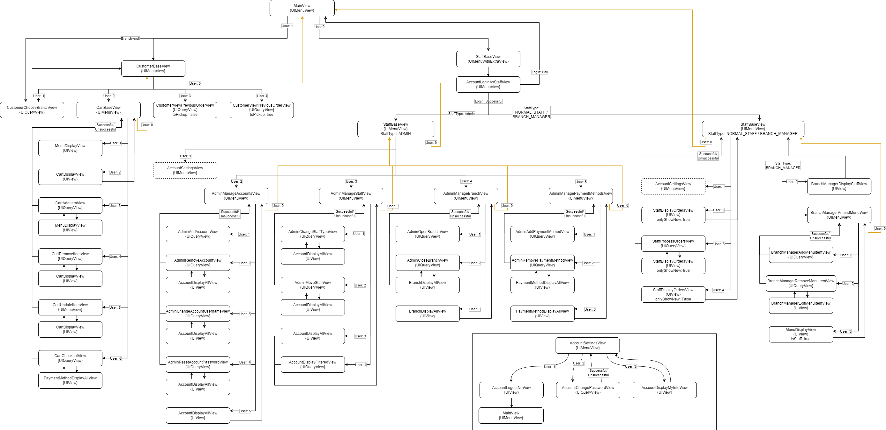
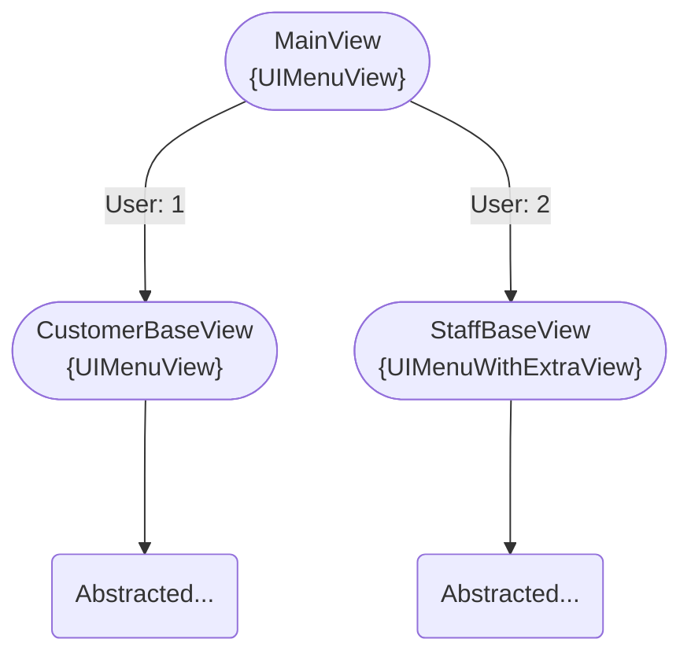
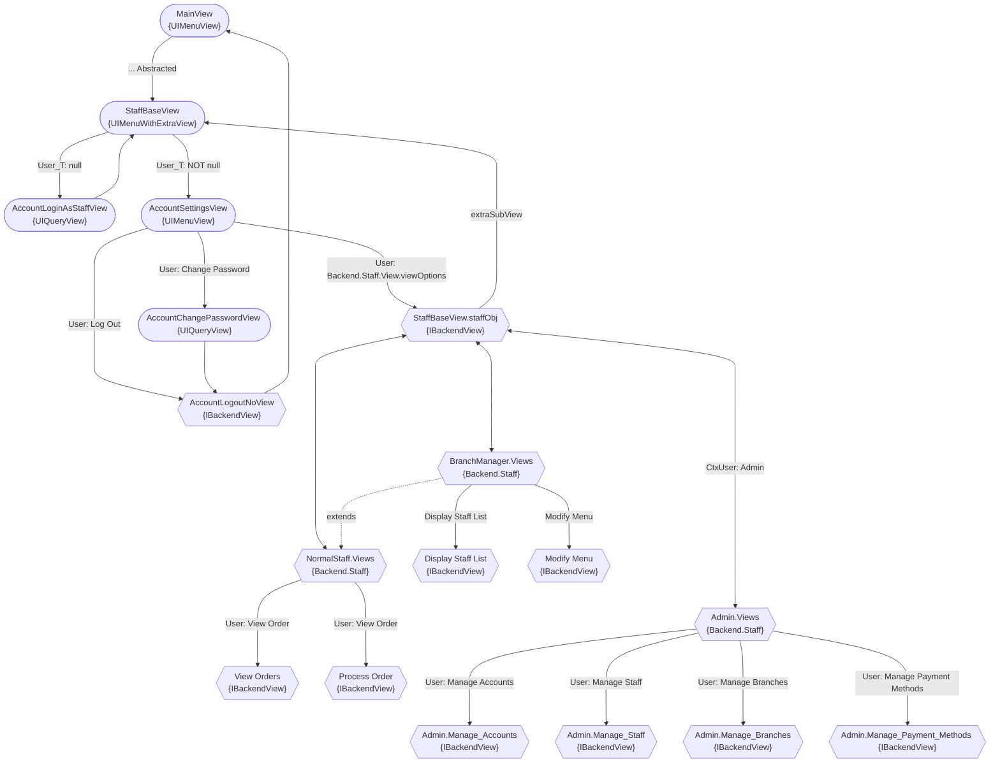

# Flow

This file shows the flow of the program...

This is outdated, but there's MORE views extended to this...

This just shows the general gist of the program flow...

## Unable to View charts

View this from the Github repository if the charts are not generating for you.

